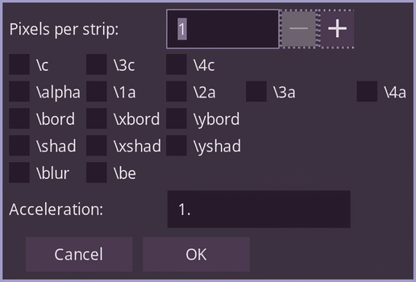
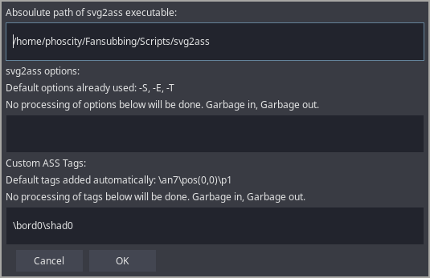
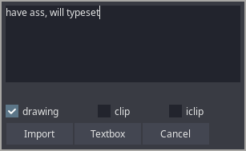
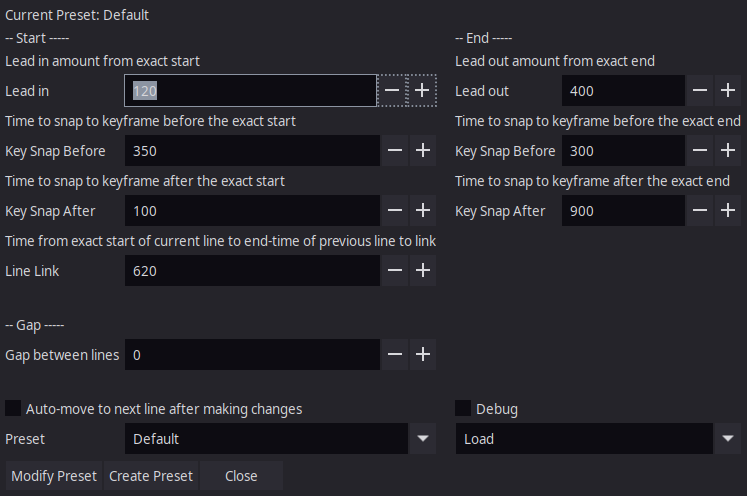
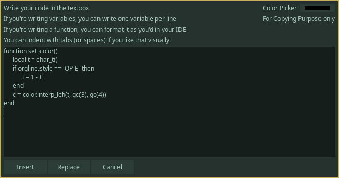

# PhosCity's Aegisub Scripts Collection

- [Typesetting](#typesetting)
  - [Add Grain](#add-grain)
  - [Auto Fade](#auto-fade)
  - [Change Alignment](#change-alignment)
  - [Edit Tags](#edit-tags)
  - [Extrapolate Tracking](#extrapolate-tracking)
  - [Fold Operations](#fold-operations)
  - [Fit Text in Clip](#fit-text-in-clip)
  - [Remove tags](#remove-tags)
  - [Rotated Gradient](#rotated-gradient)
  - [svg2ass](#svg2ass)
  - [Vector Gradient](#vector-gradient)
  - [Wave](#wave)
  - [Wobble](#wobble)
- [Timing](#timing)
  - [Timing Assistant](#timing-assistant)
  - [Bidirectional Snapping](#bidirectional-snapping)
- [Karaoke](#karaoke)
  - [KFX](#kfx)
- [Quality Checking](#quality-checking)
  - [QC Report](#qc-report)

## Typesetting

### Add Grain

**_Available in Dependency Control_**

This is the script that allows you to add static and dynamic grain to your sign. This script is based on [this guide](<https://fansubbers.miraheze.org/wiki/Guide:Adding_film_grain_(typesetting)>).

**Static Grain:**

- First cover your sign with "!". It's easier to do if you use `\an7` and break the line using "\N" when it goes over the sign. You don't have to choose Grain font. You don't have to remove border or shadow. Just add "!". You may want to change scale and add clip to the line as per sign's need. The script will convert "!" to randomized character.
  

- Run the script. There are only two options. One is to add simple grain. Another one is to add a bit denser grain as explained in the guide.

**Dynamic Grain:**

- Add "!" as usual.
- Use your favorite line2fbf script to convert line2fbf. In some cases you can go further and check if the anime is animated on twos or threes and use [petzku's script](https://github.com/petzku/Aegisub-Scripts/blob/master/macros/petzku.SplitTimer.moon) to split line in `n` frames accordingly.
- Run the script and you have a dynamic grain.

### Auto Fade

**_Not Available in Dependency Control_**

This script will automatically calculate fade in and fade out for you. You need to use arch1t3cht's Aegisub for this script.

https://user-images.githubusercontent.com/65547311/226902839-28768b67-d9f1-44aa-ab8a-6ab930764ecd.mp4

**Steps:**

- Time your sign.
- Determine if your sign has fade in, fade out or both.
- Play the video until you reach a frame in which there is neither fade in nor fade out.
- Hover over the Japanese sign, right click and choose "Copy coordinates to Clipboard".
- Open the script (while staying in the same video frame) and paste the coordinates. Then choose if you want fade in or fade out or both and run the script.
- The script will automatically add appropriate fade to your text. Fade out is a bit slower than fade in.

### Change Alignment

**_Available in Dependency Control_**

This script allows you to change the alignment of the selected lines while maintaining appearance. It supports shapes as well as texts and handles perspective tags relatively well.

### Edit Tags

**_Not Available in Dependency Control_**

The main idea is that it presents the tags, and it's value of the current line in a HYDRA like GUI so that I can easily edit the values of that tag. It is mostly useful for complex lines that has a lot of tags. It separates start tags, inline tags and transforms in different sections for easy editing.

When you run the script on a line, following gui is generated:

I've tried to make GUI as similar to HYDRA as possible since the familiarity helps with finding which tags you want to edit. The tags present in your lines are ticked and the effective tag values are pre-filled. Here effective tags value means that if the tag is not available in the line, the tag value is taken from style. Not only you can change the value of the ticked tag in the GUI, but you can also tick any tags of the GUI to add that tag to the line. You can also untick any tag to remove them from the line. The order of your tags are respected.

While I did not plan to add an option to modify tags in multiple lines, for the sake of completion, I added one nonetheless. Its usefulness is highly doubtful. I took inspiration from unanimated's Modifire. In short, if you select multiple lines and run the script, following GUI will be shown which shows tags in all the selected lines without duplication. It's essentially find and replace for tags i.e. if you change the value of the tag in the GUI, all the instances of that said tag will be modified. However, the difference is that you can find and replace as many tags as you want all at once.

### Extrapolate Tracking

**_Not Available in Dependency Control_**

When you're motion-tracking a sign, and you cannot track the first or last few frames either because the sign moved out of the screen or it faded out, you can use this script to extrapolate the tracking for those lines. There is a similar function in 'Significance' script by unanimated, but it only extrapolates scaling and position. This script goes a little beyond and extrapolates the following tags.

On top of that, it also supports extrapolating only tags selected by the user.

**Steps:**

- If you already have badly tracked lines in Aegisub, mark those lines with 'x' in Effect.
- Instead, if you only have correctly tracked lines in Aegisub, write 'x,n' in the first or last correctly tracked line where you replace 'n' with the number of new lines you want to insert before or after the marked line. For example, if you write 'x,5' in last line, the script will insert 5 new lines with extrapolated tags after it. If you mark the first line, it'll insert 5 new lines before marked line.

- Select the lines you marked plus frames before or after it. How many frames you select depends on how "linear" the tracking is. With perfectly linear tracking, you can select all the tracked lines to get more accurate extrapolation. If there seems to be a small accel, use only about 5 reference frames.

**Requirements:**

- All selected lines must be 1 frame long.
- Selection must be consecutive and sorted by time.
- If lines are split in layers, run the script separately for each layer.

### Fold Operations

**_Not Available in Dependency Control_**

If you use [arch1t3cht's Aegisub](https://github.com/arch1t3cht/Aegisub), then it comes with a feature to visually group and collapse lines in the subtitle grid called folds. This script allows you to operate on such lines. Currently, the only operations available are to select all the lines of the fold around active line, comment the lines of the current fold and add folds around the selected lines by enclosing them in a comment. But there'll be more fold operations in the future.

### Fit Text in Clip

**_Not Available in Dependency Control_**

https://user-images.githubusercontent.com/65547311/215322416-523ba2cf-d8e1-41d3-a0a8-264550c5fe92.mp4

This script will fit the text in the current line inside the rectangular clip and try to make it justified.

This script uses [Yutils](https://github.com/TypesettingTools/Yutils) to determine the width of the text. Therefore, the efficacy of this script entirely depends on whether Yutils can accurately determine the width of the text or not. If things goes south, the likely cause is either Yutils or the font that you're using has kerning beyond repair. Even when all things go right, sometimes you may have to manually edit some lines to make it look as intended.

### Remove Tags

**_Available in Dependency Control_**

This script deals with all things related to removing tags from the line. One of the main motivation for writing this script when a script like unanimated's `Script Cleanup` exists is because I would spend a lot of time searching the exact tag I wanted to remove from the 40 options of the GUI. When I have only 10 tags, I wanted to choose the tags I want to remove from those 10 tags only. So, GUI of this script is dynamically generated i.e. only tags that are available in the selected lines are available for you to remove. The GUI from the image above is not what you'll see when you run it.

#### `Remove All` button

- If you simply click the `Remove All` button, it removes all the tags form the selected lines.
- If you check `Start Tags` in the top row and then press `Remove All` button, it removes all start tags from selected lines.
- Similarly, checking `Inline Tags` in top row removes all inline tags.

#### `Remove Tags` button

- All the tags that you individually tick would be removed.
- If `Start tags` is checked, the selected tags will only be removed from start tags.
- If `Inline tags` is checked, the selected tags will only be removed from inline tags.
- If `Transform` is checked, the selected tags will only be removed from transforms.
- If `Inverse` is checked, all the tags except the selected ones will be deleted.

#### `Remove Group` button

This button executes the things you select in the left column and is mostly used to delete groups of tags at once. Staying true to it's mission, the script also dynamically creates this section. Which means that if your selection does not contain any color tags for example, the option to remove color tags won't be available. You can also tick `Start Tag` or `Inline Tag` the top row and only remove the tag group from start tag block or inline tag block only. The groups available are:

- All color tags (c, 1c, 2c, 3c, 4c)
- All alpha tags (alpha, 1a, 2a, 3a, 4a)
- All rotation tags (frz, frx, fry)
- All scale tags (fs, fscx, fscy)
- All perspective tags (frz, frx, fry, fax, fay, org)
- All inline tags except last (useful for undoing gradient)

TODO (Maybe): An option to select and remove each individual transform tags.

### Rotated Gradient

**_Available in Dependency Control_**

This script allows you to create a gradient at an angle using clips. Traditionally, to create a rotated gradient, you'd have to create a small strip of shapes. However, this script allows you to use clips which has many advantages one of which is simply being able to edit text. It's not perfect but works in the cases I've tried.

Instead of trying to explain with words, here's a video showcasing the usage of the script. The same can be applied for any angle or rotated text.

  
Click here to see the example

  
https://user-images.githubusercontent.com/65547311/180961066-708b636b-60e3-450c-bb42-395cfcda7298.mp4

One word of caution: If your text has border and shadow, you must split the lines into layers with and without border (I hope you already do this if you call yourself a typesetter) and then depending on if you want to gradient fill or border and shadow, run the script in that layer. Otherwise, you may see strips in you line. This is not a limitation of this script. This is limitation of ASS rendering.

### svg2ass

**_Available in Dependency Control_**

The script svg2ass is a wrapper for a program [svg2ass](https://github.com/irrwahn/svg2ass) which allows you to select an SVG file from Aegisub itself and convert it to shape, clip or iclip. It works in both windows and Unix operating system. I generally create SVG files using GIMP(can perform complex selections and convert those selections to SVG in a matter of seconds) or Inkscape and use svg2ass to convert them to subtitle lines. If you cannot/ do not want to compile svg2ass, then there is also a [website](https://qgustavor.github.io/svg2ass-gui/) where you can upload the SVG file to obtain the output.

The first thing you should do is to set the config and provide the path where you have the svg2ass executable. At the same time, you can also provide custom tags you want to append to final result and the custom svg2ass parameters if you prefer.

To use this script, simply click on `Import` button and select the SVG file. The resulting lines will have the same start time, end time and style as the selected line. If you checked clip or iclip in the GUI, the resulting shape will be converted to clip or iclip respectively. Alternatively if you don't have the svg2ass executable, you can get the output of svg2ass from the website and paste the result in the textbox and click on the `Textbox` button. The resulting lines will the same as `Import`

### Vector Gradient

**_Not Available in Dependency Control_**

The original idea for using vector shapes to create gradient was shared by [Noroino Hanakao](https://github.com/noroinohanako) . This script only automates this process. The main idea is that this script creates shapes that when blurred gives you a gradient. You should create a vectorial clip and run the script which creates the shapes.

| Name  | Number of clip points | Gradient type |
| ----- | --------------------- | ------------- |
| Wedge | 3                     | Linear        |
| Ring  | 2                     | Radial        |
| Star  | 2                     | Radial        |

### Wave

**_Available in Dependency Control_**

Wave is a script that allows you to mimic the wavy signs through some fscx, fscy and fsp trickery. When you open the scripts, there are few parameters you can change, and you'll have to go through some trial and error to determine what values give you the result you want.

Credits for the original code excerpt before my modification goes to [The0x539](https://github.com/The0x539)

Below are few examples of what kind of waves you can achieve but depending on the values you use, you can create different types of waves as well.

https://user-images.githubusercontent.com/65547311/164889225-2d8a6ccf-7798-4810-a3cf-3f87568abef0.mp4

### Wobble

**_Available in Dependency Control_**

Wobble is a remake of a very old script that distorts the text with the parameters you choose. The old script however was very difficult to use. It neither recognized the text already present in the line nor the tags used nor did it output the result in a usable format. So I decided to remake it and add other features.

When you open the script, you will be presented with the GUI as shown above. Imagine that when you use this script, it distorts the text along a wave horizontally or vertically or both. The parameters control the nature of the wave thus controls how the text is distorted. Frequency is the number of waves (crest and trough) you want in the text in percentage. You'll most likely use 20-40% for optimum results. Strength is the number of pixels that the text will be distorted to. With trial and error, you can create many interesting distortions.

As you can see below, the top is the original font and everything below it is distorted using this script. I use it when the sign is distorted or I need an irregular font that I cannot find.

#### Animate the distortion

If you want to animate the distortion, first split the line to frames. You can use something like [petzku's script](https://github.com/petzku/Aegisub-Scripts/blob/master/macros/petzku.SplitTimer.moon) to do so. You can control the speed of animation by controlling the number of frames each line has. The more frames per line, the slower the animation. After splitting the line to frames, you need to put the starting value and ending value. I recommend you figure this out beforehand by using main GUI. After you put the starting and ending value for all the required elements, click on `Animate` and the script will handle the rest.

  
Click here to see example animations

  
https://user-images.githubusercontent.com/65547311/179356858-4179c754-93ad-4bdf-b4fe-befc0546d33e.mp4

https://user-images.githubusercontent.com/65547311/179356862-a29a5b9d-9cb3-4cb9-b7c2-e6c5269063ef.mp4

#### Animate the wave

Again, split the lines into frames first. Then this time put wave speed along with other parameters. The acceptable value for wave speed is 1-5 but 1 or 2 might be enough for most cases. (Thanks to Alendt for this)

  
Click here to see example wave animation

  
https://user-images.githubusercontent.com/65547311/194462155-1cc8c1c1-d4e2-41f5-84ed-1046d1da2f79.mp4

## Timing

### Timing Assistant

**_Available in Dependency Control_**

When I time, I always make a series of decision for every line. Do I need to add lead in, lead out, snap to keyframes or link the lines? So I wanted to create a script that allows me to do it in a press of a hotkey. You might be thinking, "Phos, you just made a TPP". I can assure you it's not. The workflow of using this script is the same as timing without TPP, but only difference is that the aforementioned decisions is made for you by the script.

How to use:

The first thing to do after you install the script is to set up the config. By default, it contains the values I use and what I consider sane defaults. You are however free to change it and the script will perform as intended as long as the values you put are within reason. The second thing to do is of course hotkey the script in audio section.

Now you are ready for timing. Here, you'll first do the exact timing on the line and then press the hotkey. The script will make the decision for you whether it should add lead in, snap to keyframe, link the lines together or add lead out. You then move to the next line by pressing 'g' and repeat. _Exact time, hotkey. Exact time, hotkey. That's it._

I have come to like this method because it has the convenience of decision-making of TPP but at the same time, if I do not agree with the script, I am free to fix it and move to next line.

**Note**: If the end time of your line exceeds the audio of next line, don't fix it. Go to the next line, exact time it and then press the hotkey. The script will fix it. It works in this manner because it can only make proper decision of line linking of current line in context of start time of next line.

If you want to check exactly what steps the script takes for decision-making, expand the following and let me know if I got something wrong.

  
Click here to expand

For start time:

1. If start time is already snapped to keyframe, it does not make any changes to the start time.
1. Checks if there is a keyframe within the time specified in the config and snaps to it.
1. If it was not snapped, it checks the end time of previous line. If it is within the linking time specified in config and not snapped to keyframe, it adds lead in to current line and extends the end time of the previous line.
1. If it was neither snapped nor linked, it simply adds lead in.

For end time:

1. If end time is already snapped to keyframe, it does not make any changes to the end time.
1. Here's a special step that is only applicable when your keyframe snapping value is greater than 850 ms. Snapping to keyframes more than 850 ms away is not always the correct thing to do, hence this special step. If the script finds that there is a keyframe 850+ ms away from exact end, and you've allowed to snap to that distance in config, then it first checks cps of the line (without leadout). If cps is greater than 15, then it snaps to keyframe. If the cps is less than 15, then it either tries to add lead out to the line or extend the end time such that it is 500 ms away from keyframe whichever is lesser.
1. If above special case is not true(which is most of the case), it simply checks if there is a keyframe within time specifed in the config and snaps to it.
1. If it did not snap, it simply adds lead out to the line.

### Bidirectional Snapping

**_Available in Dependency Control_**

If you're a timer like me who does not use TPP and times primarily using hotkeys, then you'll be disappointed to know that Aegisub does not have hotkeys specifically for timing. While there are other scripts that allow you snap to keyframes, they are either a simple snap to adjacent keyframes or a TPP style snapping scripts. This one is geared towards timing.

While timing, you might have come across the case multiple times when you go to the next line only to realize that the end time of the line overshoots the keyframe you want to snap to. Then you have no choice but to snap backwards using mouse. Here's where this script comes handy. This script is made to be hotkeyed, so first hotkey the end snapping and the start snapping function in the audio section. When you press the hotkey to snap end once, it snaps to the keyframe ahead. If you press the same hotkey again, it snaps to the keyframe behind. Then every press of the hotkey will continue snapping to previous keyframe. This way, you can snap to the keyframe ahead or behind using the same hotkey. For the start time, the opposite happens. One press snaps behind, and then double press snaps forward.

I use Bidirectional Snapping in combination with [this script](https://github.com/The0x539/Aegisub-Scripts/blob/trunk/src/0x.JoinPrevious.lua) which is also hotkeyed and allows me to link the previous line to current line without moving to previous line.

An attempt has been made below to showcase its usage, but you should use it yourself to see how it works. Here, `w` has been hotkeyed to end-snapping and `q` has been hotkeyed to beginning-snapping.

https://user-images.githubusercontent.com/65547311/168461607-d575b757-4504-4a31-8c9b-f52d01fe566f.mp4

## Karaoke

### KFX

**_Not Available in Dependency Control_**

https://user-images.githubusercontent.com/65547311/177035842-e1a4b930-07b8-4ea0-82a2-16a3de8552e6.mp4

This script is designed to write or modify karaoke template lines for [The0x539's KaraTemplater](https://github.com/The0x539/Aegisub-Scripts/blob/trunk/src/0x.KaraTemplater.moon)

#### Buttons

- Next: Proceed to next step
- Insert: Insert a new line above the current selected line
- Replace: Replace the current selected line
- Modify: Modify the template in the current selected line

#### First Window - Line Marker

The first window allows you to select line markers. You won't be able to proceed unless you select a line marker.

#### Second Window - Modifiers

The second window allows you to choose modifiers. This is not compulsory, and you can proceed without choosing anything. For modifiers that need extra arguments, you can type them in the textbox. The options are dynamic i.e. only the modifiers available for the chosen line markers are available for choosing.

#### Third Window - Effect

The third window allows you to write the actual effects. If you chose `code` line marker, a text box will appear where you can write your code. Variables can be written one variable per line. Function can be written as you write in your IDE. Indentation is purely visual and not necessary, but you can indent with tabs or spaces if you wish.

For any other line marker, a HYDRA type GUI will appear. Every box is a textbox so that you can write value, variables or function. If you don't find any option for what you want to write, the `Additional` option is for you.

If you tick transform, this same GUI will be reloaded for you to write tags inside the transform section.

In the bottom, there are boxes for the effect, actor and text. While these are for giving you information of current state of template line, you can edit it manually, and it will be saved.

## Quality Checking

### QC Report

**_Not Available in Dependency Control_**

This script is designed to write and generate QC reports from Aegisub. If you wish to write QC reports using a media player, there is a program called [mpvQC](https://github.com/mpvqc/mpvQC) which is designed to do just that.

The top row of the GUI consists of configurable sections like timing, typesetting etc. that you can tick to specify the type of note. If nothing is ticked, it's treated as a general note. Below that is a drop-down which has pre-made reports for each sections for making even faster notes.

Below that is a textbox where you are free to write you report. The way you format your report in the textbox is preserved. If you selected any pre-made reports, it is appended to the beginning of the text in the text-box. You can leave this box empty and only select the pre-made report.

Finally, there is a checkbox called `Use video frame`. Normally, the report is added to current line but if you tick this, the report is added on the basis of the current video frame. If the current video frame has a subtitle, then the report is added to that line. If there isn't, then an empty line with report is inserted whose time is same as the video frame.

After you write all your notes, you can generate a report and a properly formatted note will with time will be generated that you can copy and share. The generated report is fully compatible with arch1t3cht's [Note Browser](https://github.com/arch1t3cht/Aegisub-Scripts#note-browser) script. After you generate the report, and you no longer need them in your subtitle, you can clean them up too.

There is also a config where you can configure a lot of things about the script so be sure to check that out.
