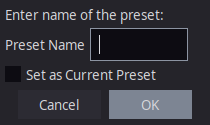

**Available in Dependency Control**

[Link to
script](https://github.com/PhosCity/Aegisub-Scripts/blob/main/macros/phos.TimingAssistant.moon)

When I time, I always make a series of decision for every line. Do I need to
add lead in, lead out, snap to keyframes or link the lines? So I wanted to
create a script that allows me to do it in a press of a hotkey. You might be
thinking, "Phos, you just made a TPP". I can assure you it's not. The workflow
of using this script is the same as timing without TPP, but only difference is
that the aforementioned decisions is made for you by the script.

## Usage

The first thing to do after you install the script is to assign a hotkey for
the script in Aegisub. When you do add a hotkey, make sure you add it in the
Audio section.

In order to time a line, you first exact time a line (subtitle starts and ends
exactly with audio) and then press the hotkey. The script will make the
decision for you whether it should add lead in, snap to keyframe, link the
lines together or add lead out. You then move to the next line by pressing `g`
and repeat. _Exact time, hotkey. Exact time, hotkey. That's it._

!!! info

    If the end time of your line exceeds the audio of next line, don't fix it.
    Go to the next line, exact time it and then press the hotkey. The script will
    fix it. It works in this manner because it can only make proper decision of
    line linking of current line in context of start time of next line.

If you want to check exactly what steps the script takes for decision-making, expand the following and let me know if I got something wrong.

??? note "Click here to expand"

    For start time:

    1. If start time is already snapped to keyframe, it does not make any changes to the start time.
    1. Checks if there is a keyframe within the time specified in the config and snaps to it.
    1. If it was not snapped, it checks the end time of previous line. If it is within the linking time specified in config and not snapped to keyframe, it adds lead in to current line and extends the end time of the previous line.
    1. If it was neither snapped nor linked, it simply adds lead in.

    For end time:

    1. If end time is already snapped to keyframe, it does not make any changes to the end time.
    1. Here's a special step that is only applicable when your keyframe snapping value is greater than 850 ms. Snapping to keyframes more than 850 ms away is not always the correct thing to do, hence this special step. If the script finds that there is a keyframe 850+ ms away from exact end, and you've allowed to snap to that distance in config, then it first checks cps of the line (without leadout). If cps is greater than 15, then it snaps to keyframe. If the cps is less than 15, then it either tries to add lead out to the line or extend the end time such that it is 500 ms away from keyframe whichever is lesser.
    1. If above special case is not true(which is most of the case), it simply checks if there is a keyframe within time specified in the config and snaps to it.
    1. If it did not snap, it simply adds lead out to the line.

## Config

When you use the script for the first time, it uses values that I consider sane
defaults. You are however free to change it and the script will perform as
intended as long as the values you put are within reason.

### Creating a new preset

Creating a new preset is as easy as changing the values in the GUI and hitting
the `Create Preset` button.

You will then be asked the name of the preset. If you want to use the preset as
soon as you create it, tick on `Set as Current Preset`.

### Actions on preset

Once you have a preset, you might want to perform some actions on them. First
select the preset you want to act on in the left dropdown. Then select the
action you want to perform on it in the right dropdown. Then finally click on
`Modify Preset` button.

#### Load

This just loads the values of that preset in the GUI.

#### Modify

This modifies the preset with the values that is currently in the GUI.

#### Delete

This deletes the preset. Default preset cannot be deleted.

#### Rename

This renames the preset.

#### Set Current

This sets the preset and the current preset and its value will be used whenever you press the hotkey.
